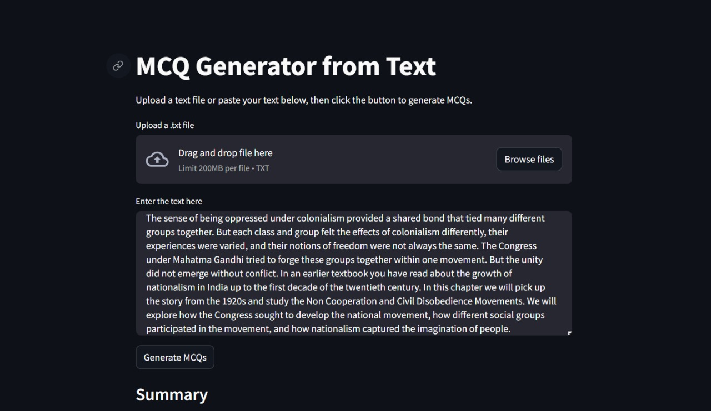
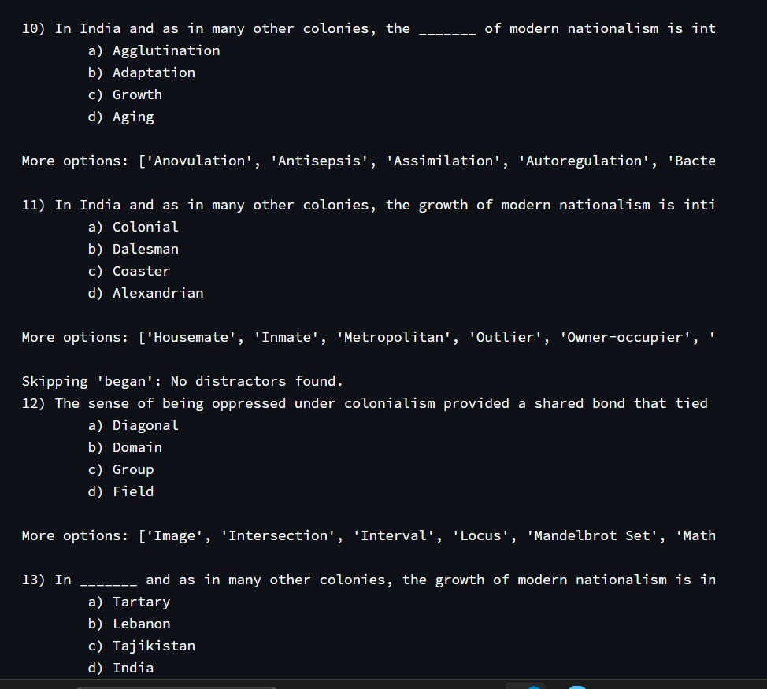

# Automated-MCQ-Generation
This repository contains a Python script for generating multiple-choice questions (MCQs) from a given text passage. The script utilizes natural language processing (NLP) techniques, including keyword extraction, word sense disambiguation, and distractor generation, to generate MCQs automatically.

# Features
Text Summarization: Utilizes BART (Facebook's BART model) for text summarization to generate concise summaries of long passages.
Keyword Extraction: Uses KeyBERT to extract keywords from the text, which are essential for generating MCQs.
Word Sense Disambiguation: Performs word sense disambiguation using WordNet and ConceptNet to understand the context of keywords in the text.
Distractor Generation: Generates distractors (incorrect answer choices) for each keyword using both lexical and BART-based methods.
Multiple-Choice Question Generation: Generates MCQs with the given text passage, keywords, and distractors.

# Usage
Clone the repository or download the Python script.
Install the required dependencies using pip install -r requirements.txt.
Open the Python script and replace the article variable with your text passage.
Run the script.

# Requirements
Python 3.x
PyTorch
Transformers library
NLTK
spaCy
WordNet
ConceptNet
KeyBERT

